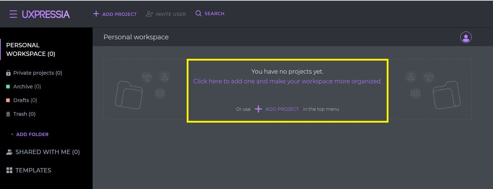
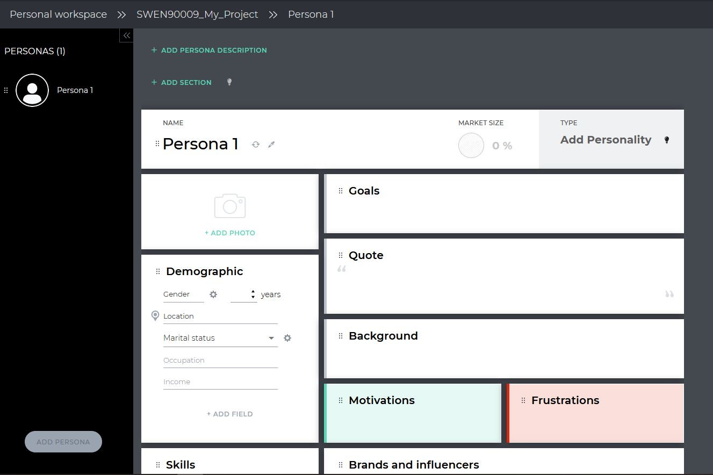

# Appendix C: Tools for Personas

There are different tools you can use to create your personas. In this tutorial, we will introduce 4 tools to you.

## Hubspot - Make My Persona

- Firstly, you do NOT need a Hubspot account to use this tool. Visit 
[this link](https://www.hubspot.com/make-my-persona).
- Once you click the "Build My Persona" button, it will take you through a 7-steps tour to create your persona. 
- Or, you can just choose to skip walkthrough mode and edit it yourself.
 
- Either way, you will get the chance to edit/add/delete sections at the end. 

### Save and Export

Yes - you can save this persona and edit it later. What you do is: 
1. Once you finish the 7-steps tour, or you have chosen the option to skip the tour, you will arrive at a 
"Make My Persona Overview" page. 
2. Click the save button.


3. It will ask you to fill in some personal details.
4. After you have filled in your personal details, click the "Download Now" button. 


5. You can download your persona as a PDF. You will also be given a link that you can use to access it in the 
future, or share with your team members 


### Any Disadvantages?

For the persona photo, you can only use a pre-defined set of avatar (around 15 choices) - no real images options. 
You cannot copy and paste photos either.

```{warning}
If you search for Hubspot persona on Google, you might find 
[this tutorial](https://knowledge.hubspot.com/contacts/create-and-edit-personas). 
This is **VERY DIFFERENT** to the Make My Persona tool. Please don't use this one. 
```

## PersonaGenerator

This tool is pretty straight-forward. After you visit [this link](https://personagenerator.com/), you can start 
creating your persona by filling in content.

### Save and Export

- You get two links: one is view-only, one allows editing. You can share the two links in your team to edit/view 
your personas.
- You can print the persona as a PDF. 

### Any disadvantages?

You **cannot** change the section title, add a new section or delete a section. In other words, the sections you can 
have on your persona are fixed. Please consider this before you choose this tool. 

## UXPRESSIA

1. To use this tool, create an account with UXPRESSIA for free. Visit 
[this link](https://uxpressia.com/personas-online-tool).
2. Firstly, you need to sign up. 
3. After you have signed up successfully, you will arrive at your personal workspace. Create a project. 


4. In your project, you can create your persona. Click "ADD NEW"


5. Select "PERSONAS". You can start with a blank one, then edit it yourself.


6. Uxpressia allows you to be very flexible with your sections - you can add/delete them, and there are different 
types of sections to choose from (e.g. text, sliders). 


### Any Disadvantages?

The following restrictions are limitations of a free plan:
1. You can only create one persona per project. 
2. You can only create one project per account
3. You can only export it as a PNG.
4. To share your persona, you need to share your project first. The free plan only let you share your project with 
1 person via email. 

```{tip}
You could form small teams of 2 within the team to work on a persona. For review, the smaller teams can 
exchange their personas. You will need to create multiple accounts with UXPRESSIA.
```

## Xtensio

Visit [this link](https://xtensio.com/user-persona-template/) to start exploring.

### Any Disadvantages?

The following restrictions are limitations of a free plan:
1. You cannot share the work with anyone.
2. You cannot download it as a PNG or PDF.
3. Your work expires after a couple of hours. 


We do not recommend the free version of this tool due to the above limitations.  If your team has explored other 
tools and decided that you want to use this one, check out their 
[pricing](https://xtensio.com/pricing/?_gl=1*rkelh8*_ga*OTU0NjY3MjY3LjE2NDIzOTQ0ODE.*_ga_EFSR9CLTP4*MTY0MjM5NDQ4MC4xLjEuMTY0MjM5NTU2Mi41Nw..).
